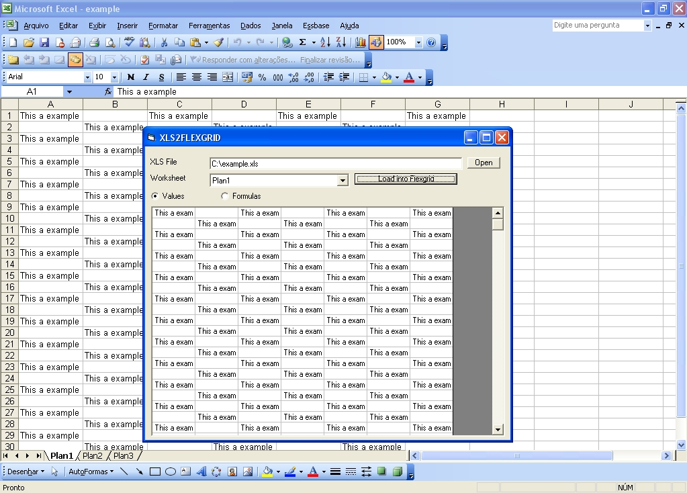



## Excel TO Flexgrid

### Description

Very fast code, with few lines, load entire worksheet into MSFlexgrid using arrays and Excel VBA. Also has a example about Commond Dialog API.

*** MSFlexgrid has some limitations over number of rows and cols (allocation memory), but you can load a huge worksheet into array (in a single line of code), in that case, the only limitation is your free RAM.
 
### More Info
 

             |
---                |---
**Submitted On**   |2005-06-29 13:00:02
**By**             |[Cristiano Couto\.](https://github.com/Planet-Source-Code/PSCIndex/blob/master/ByAuthor/cristiano-couto.md)
**Level**          |Advanced
**User Rating**    |4.3 (13 globes from 3 users)
**Compatibility**  |VB 5\.0, VB 6\.0, VBA MS Excel
**Category**       |[Microsoft Office Apps/VBA](https://github.com/Planet-Source-Code/PSCIndex/blob/master/ByCategory/microsoft-office-apps-vba__1-42.md)
**World**          |[Visual Basic](https://github.com/Planet-Source-Code/PSCIndex/blob/master/ByWorld/visual-basic.md)
**Archive File**   |[Excel\_TO\_F1906946292005\.zip](https://github.com/Planet-Source-Code/cristiano-couto-excel-to-flexgrid__1-61399/archive/master.zip)

